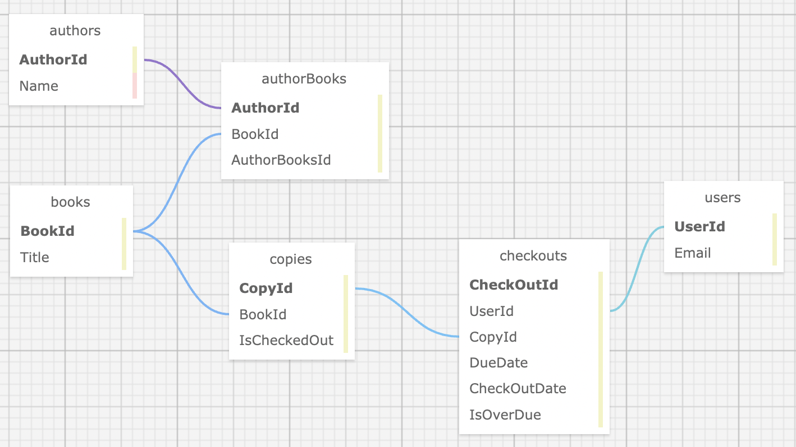

# Library

#### By Kirsten Opstad & Brian Noh

#### An app to catalog a library's books and let patrons check them out

## Technologies Used

* C#
* .Net 6
* ASP.Net Core 6 MVC
* EF Core 6
* SQL
* MySQL
* LINQ
* Identity

## Description

An app to catalog a library's books and let patrons check them out. Below are some user stories that define MVP.

### Objectives (MVP)

#### User Stories
* As a librarian, I want to __create, read, update, delete__, and list books in the catalog, so that we can keep track of our inventory.
* As a librarian, I should only be able to create, update and delete if I am __logged in__. All users should be able to have read functionality. (Hint: authorize CUD routes for books.)
* As a librarian, I want to __search__ for a book by author or title, so that I can find a book when there are a lot of books in the library.
* As a librarian, I want to __enter__ multiple authors for a book, so that I can include accurate information in my catalog. (Hint: make an authors table and a books table with a many-to-many relationship.)
* As a patron, I want to __check a book out__, so that I can take it home with me. I should only be able to do this if I am logged in.
* As a patron, I want to know __how many copies__ of a book are on the shelf, so that I can see if any are available. (Hint: make a copies table; a book should have many copies.)
* As a patron, I want to see a __history of all the books__ I checked out, so that I can look up the name of that awesome sci-fi novel I read three years ago. (Hint: make a checkouts table that is a join table between patrons and copies.)
* As a patron, I want to know when a book I checked out is __due__, so that I know when to return it.
* As a librarian, I want to see a __list of overdue books__, so that I can call up the patron who checked them out and tell them to bring them back — OR ELSE!

#### Database Schema



<!-- [Link to operational site](http://www.kirstenopstad.github.com/<REPOSITORY NAME>) -->

### Goals
1. Meet MVP
2. Add Styling
3. Stretch: 

## Setup/Installation Requirements

#### Get copy of MySQL database
1. Clone this repo to your workspace.
2. Open MySQLWorkbench [Click here for instructions to download]
3. Under Administration Tab, select Data Import/Restore
  * Select 'Import from Self Contained File'
  * Select ../animal-shelter-export.sql from the AnimalShelter directory
  <!--  -->
  * Select "New..." and set new schema name to **PROJECT-NAME**
  * Select 'Start Import'
4. You should now have a copy of the **PROJECT-NAME** database on your machine.

#### Open project
1. Navigate to the `Library` directory.
2. Create a file named `appsettings.json` with the following code. Be sure to update the Default Connection to your MySQL credentials.
```
{
  "ConnectionStrings": {
    "DefaultConnection": "Server=localhost;Port=3306;database=library;uid=[YOUR-USERNAME-HERE];pwd=[YOUR-PASSWORD-HERE];"
  }
}
```
3. Install dependencies within the `Library` directory
```
$ dotnet restore
````

4. To build & run program in development mode 
 ```
 $ dotnet run
 ```

5. To build & run program in production mode 
 ```
 dotnet run --launch-profile "production"
 ```

## Known Bugs

* No known bugs. If you find one, please email me at kirsten.opstad@gmail.com with the subject **[_Repo Name_] Bug** and include:
  * BUG: _A brief description of the bug_
  * FIX: _Suggestion for solution (if you have one!)_
  * If you'd like to be credited, please also include your **_github user profile link_**

## License

MIT License

Copyright (c) 2022 Kirsten Opstad 

Permission is hereby granted, free of charge, to any person obtaining a copy of this software and associated documentation files (the "Software"), to deal in the Software without restriction, including without limitation the rights to use, copy, modify, merge, publish, distribute, sublicense, and/or sell copies of the Software, and to permit persons to whom the Software is furnished to do so, subject to the following conditions:

The above copyright notice and this permission notice shall be included in all copies or substantial portions of the Software.

THE SOFTWARE IS PROVIDED "AS IS", WITHOUT WARRANTY OF ANY KIND, EXPRESS OR IMPLIED, INCLUDING BUT NOT LIMITED TO THE WARRANTIES OF MERCHANTABILITY, FITNESS FOR A PARTICULAR PURPOSE AND NONINFRINGEMENT. IN NO EVENT SHALL THE AUTHORS OR COPYRIGHT HOLDERS BE LIABLE FOR ANY CLAIM, DAMAGES OR OTHER LIABILITY, WHETHER IN AN ACTION OF CONTRACT, TORT OR OTHERWISE, ARISING FROM, OUT OF OR IN CONNECTION WITH THE SOFTWARE OR THE USE OR OTHER DEALINGS IN THE SOFTWARE.
